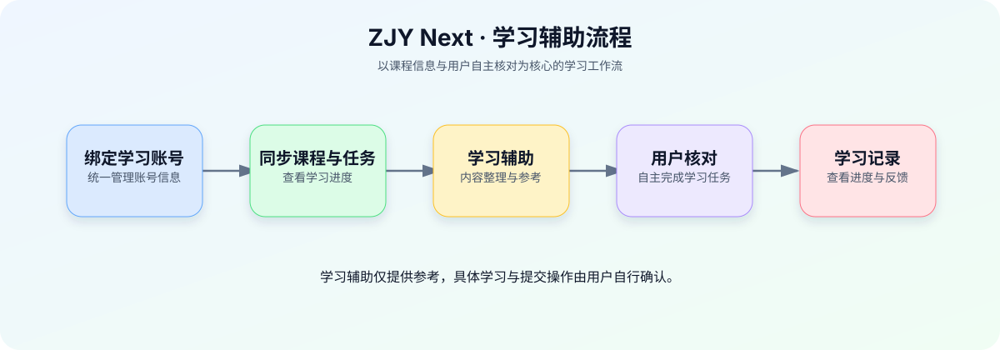

# ZJY Next

  面向职教云学习场景的课程与学习辅助平台

  
  
  
  

> ZJY Next 是一个围绕课程学习、任务查看、学习进度与资源管理构建的 Web 平台，提供清晰的学习工作台与辅助能力，帮助用户更高效地完成日常学习安排。

## 🌐 在线访问

> 项目地址请在仓库的 **About** 区域填写；如需访问权限，请联系项目维护者。

## ✨ 核心功能

### 📚 课程与学习任务

- 统一查看已绑定账号下的课程、章节与学习任务
- 在学习工作台中汇总任务状态与学习进度
- 查看任务详情、答题记录与相关课程信息

### 🤖 学习辅助

- 提供题目内容整理与答案预览辅助
- 支持接入不同的 AI 服务提供方
- AI 结果仅用于学习参考和逐题核对，最终提交由用户自行确认

### 👤 账号与安全

- 支持账号绑定、登录认证与多账号管理
- 采用权限控制、访问频率限制和安全请求校验
- 管理端可进行用户、邀请码、公告与异常访问管理

### 🗂️ 学习资源与反馈

- 集中展示学习资源与平台公告
- 支持问题反馈与处理状态跟踪
- 为课程学习提供更清晰的信息入口

## 🖥️ 界面概览

| 模块 | 说明 |
| --- | --- |
| 学习工作台 | 查看学习概况、进度和待处理任务 |
| 课程中心 | 浏览课程、章节及相关任务 |
| 任务详情 | 查看题目与作答信息，并进行学习辅助操作 |
| 资源中心 | 汇集学习资料与常用入口 |
| 管理后台 | 管理用户、公告、邀请码、反馈和访问策略 |

## 🧭 学习辅助流程

> 请将 `README.md` 和 `assets/learning-assistance-flow.svg` 一起上传到 GitHub；这只是介绍图片，不包含项目源码。

## 🔒 隐私与使用说明

- 本项目仅用于个人学习管理与学习辅助，请遵守所在学校、课程平台及相关服务的使用规则。
- 不要在公开页面、截图或仓库中暴露账号密码、Cookie、访问令牌、API Key 或邮箱授权码。
- 使用第三方 AI 服务时，请先了解相应服务的隐私政策与计费规则。

## 📦 关于本仓库

**本仓库仅用于展示项目介绍与更新信息，不包含、也不发布项目源代码。**

如需查看项目动态，请关注本仓库的 README、Issues 与 Releases；功能建议或使用反馈可通过 Issues 提交。

## 📝 更新记录

- **2026-08**：完善项目说明页与功能介绍。

---

Made for a more organized learning experience.

