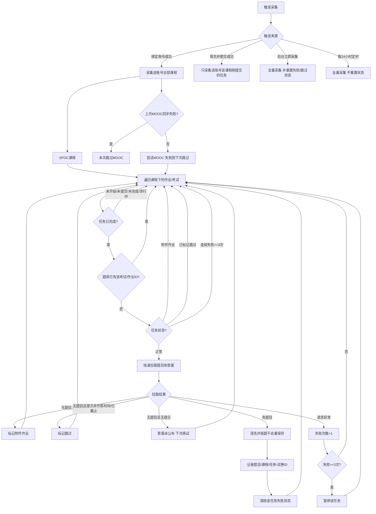
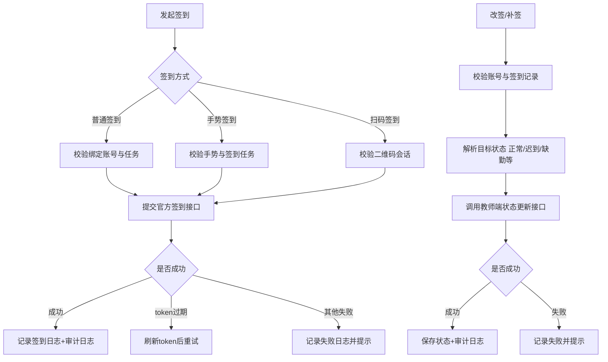
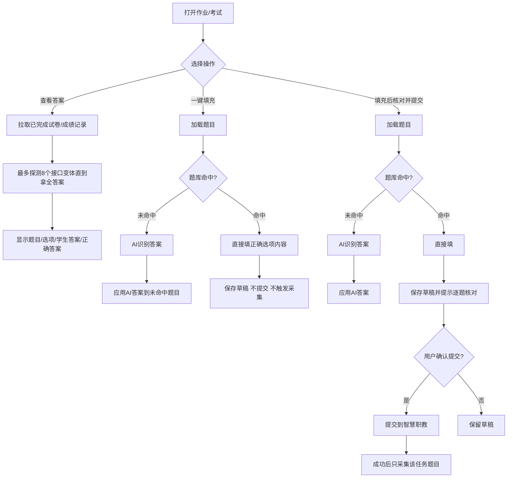
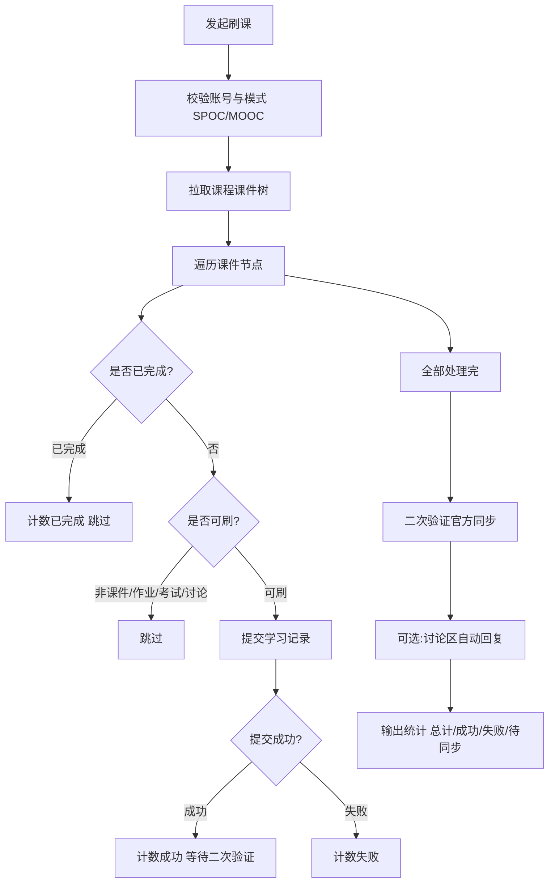

# ZJY Next

  面向职教云学习场景的课程与学习辅助平台

  
  
  
  

> ZJY Next 是一个面向职教云学习场景的效率工具，涵盖账号绑定与多账号管理、课程和课件查看、学习进度同步、普通/手势/扫码签到、作业与考试信息查看、题库归档、AI 学习辅助，以及资源、公告和反馈管理。用户可在同一工作台完成课程信息查看、任务跟进与学习记录管理。 默认邀请码：FS-99C5AE0A

 在线访问

> 🌐 项目地址：[https://4w4.top/](https://4w4.top/)　｜　如需提升账号权限，请在网站界面进行问题反馈。

## ✨ 核心功能

### ▦ 工作台

- 展示用户名称、邮箱等个人资料，以及已绑定账号数量和课程数量
- 展示平台公告，并提供常用入口的快捷导航
- 内置问题反馈窗口，便于提交使用建议或遇到的问题

### 🔗 账号绑定

- 支持 **OAuth 授权绑定**：通过授权回调完成账号关联，减少重复输入账号信息的步骤
- 支持 **账号密码绑定**：完成身份校验后建立学习账号连接，便于同步课程、任务与学习记录
- 支持多个已绑定账号的独立管理与按需切换，避免不同账号的数据混淆
- 结合登录认证、权限校验与加密凭据保护机制，降低账号信息在使用过程中的泄露风险

### 📖 课程中心

- 支持按已绑定账号查询课程，展示课程名称、教师、班级、完成进度与成绩等信息

#### 📝 作业与考试

- 查看指定课程下的作业与考试及其完成情况、答案和成绩
- 支持一键填充、自动提交与成绩查看等学习任务操作
- 在具备相应权限时，可进行成绩修改、设备清除、告警解除与退回重做等管理操作

#### 🏫 课程教学

- 查看课程课表，并可按日期筛选、锁定目标课堂
- 支持签到、补签与签到状态调整
- 展示普通签到、手势签到和二维码签到等课堂签到信息

#### 📤 学习进度提交

- 任务提交后由后端持续同步学习状态，完成视频、文档、压缩包等课件的学习进度更新
- 支持课程讨论区回复，便于完成课程互动任务

### 📂 资源中心

- 集中展示学习资源与使用说明
- 提供常用学习入口，便于快速查找资料

## 🧭 学习辅助流程

### 题库更新判断逻辑

### 签到与改签逻辑

### 查看答案、一键填充与填充并提交

### 刷课逻辑

## 🔒 隐私与使用说明

- 本项目仅用于个人学习管理与学习辅助，请遵守所在学校、课程平台及相关服务的使用规则。
- 使用本站仅作技术研究，请勿用于任何非法、违规或不当用途。
- 不要在公开页面、截图或仓库中暴露账号密码、Cookie、访问令牌、API Key 或邮箱授权码。
- 使用第三方 AI 服务时，请先了解相应服务的隐私政策与计费规则。
- 项目仍有许多需要完善的地方，欢迎通过 Issues 投稿、共创和交流。

## 📦 关于本仓库

**本仓库仅用于展示项目介绍与更新信息，不包含、也不发布项目源代码。**

如需查看项目动态，请关注本仓库的 README、Issues 与 Releases；功能建议或使用反馈可通过 Issues 提交。

## 📝 更新记录

- **2026-08**：完善项目说明页与功能介绍。

---

Made for a more organized learning experience.

